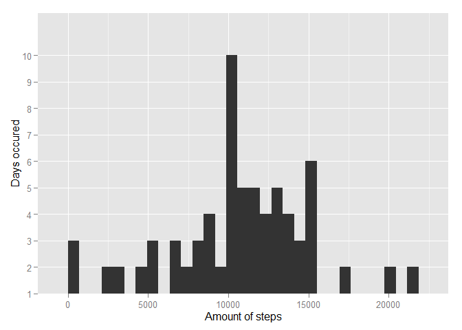

# Reproducible Research: Peer Assessment 1

## Importing libraries

```r
library(dplyr)
```

```
## 
## Attaching package: 'dplyr'
## 
## The following object is masked from 'package:stats':
## 
##     filter
## 
## The following objects are masked from 'package:base':
## 
##     intersect, setdiff, setequal, union
```

```r
library(ggplot2)
library(xtable)
library(tidyr)
options("xtable.NA.string" = "NA")
options("xtable.include.rownames" = FALSE)
options("xtable.type" = "html")
```


## Loading and preprocessing the data

```r
# df is our main data frame
df = read.csv(unz("activity.zip", "activity.csv"))
df$date = as.Date(df$date, '%Y-%m-%d')
```


## What is mean total number of steps taken per day?
Histogram below shows distribution of steps_sum per days. How many days how many steps were done.

```r
df_steps_daily_total_na_excluded = df %>%
	select(steps:date) %>%
	filter(!is.na(steps)) %>%
	group_by(date) %>%
	summarize(steps_sum = sum(steps))

qplot(steps_sum, data = df_steps_daily_total_na_excluded, 
	  xlab = "Amount of steps",
	  ylab = "Days occured") + scale_y_discrete(labels = c(1,2,3,4,5,6,7,8,9,10))
```

 
Table below shows some core values of the distribution.

```r
df_steps_mean_and_median_per_day_na_excluded = df_steps_daily_total_na_excluded %>%
	summarize('Steps Mean' = mean(steps_sum),
			  'Steps Median' = median(steps_sum))
print(xtable(df_steps_mean_and_median_per_day_na_excluded))
```

<!-- html table generated in R 3.1.3 by xtable 1.7-4 package -->
<!-- Wed Jun 10 12:39:31 2015 -->
<table border=1>
<tr> <th> Steps Mean </th> <th> Steps Median </th>  </tr>
  <tr> <td align="right"> 10766.19 </td> <td align="right"> 10765 </td> </tr>
   </table>


## What is the average daily activity pattern?
Plot below shows average amount of steps done in each interval.

```r
df_average_amount_of_steps = df %>%
	filter(!is.na(steps)) %>%
	group_by(interval) %>%
	summarize(average = mean(steps))

qplot(interval, average, data = df_average_amount_of_steps,
	  geom = "line",
	  xlab = "Intervals",
	  ylab = "Average amount of steps across all days")
```

 

```r
max = df_average_amount_of_steps %>%
	filter(average == max(average))
```

Table shows the interval with the biggest average amount of steps done.

```r
print (xtable(max))
```

<!-- html table generated in R 3.1.3 by xtable 1.7-4 package -->
<!-- Wed Jun 10 12:39:31 2015 -->
<table border=1>
<tr> <th> interval </th> <th> average </th>  </tr>
  <tr> <td align="right"> 835 </td> <td align="right"> 206.17 </td> </tr>
   </table>


## Inputing missing values

```r
df_amount_of_missing_values = df %>%
	filter(is.na(steps)) %>%
	count(steps)
```

Amount of missing values:

```r
print (xtable(df_amount_of_missing_values))
```

<!-- html table generated in R 3.1.3 by xtable 1.7-4 package -->
<!-- Wed Jun 10 12:39:32 2015 -->
<table border=1>
<tr> <th> steps </th> <th> n </th>  </tr>
  <tr> <td align="right"> NA </td> <td align="right"> 2304 </td> </tr>
   </table>

All missing values for step variable will be replaced by mean values for that 5 min interval.

```r
df_steps_daily_total = df %>%
	left_join(df_average_amount_of_steps, by = c('interval' = 'interval')) %>%
	mutate(steps = ifelse(is.na(steps), average, steps)) %>%
	group_by(date) %>%
	summarize(steps = sum(steps, na.rm = T)) %>%
	left_join(df_steps_daily_total_na_excluded, by = c('date'= 'date')) %>%
	rename(false = steps_sum, true = steps) %>%
	gather(reconstructed, steps, -date)

ggplot(df_steps_daily_total, aes(x=date, y=steps, colour = reconstructed)) +
	geom_line() +
	geom_point(size=2, shape=21, fill='white') +
	xlab("Timeline") +
	ylab("Average daily value") +
	ggtitle("Plot shows where data were reconstructed exacly")
```

```
## Warning in loop_apply(n, do.ply): Removed 2 rows containing missing values
## (geom_path).
```

```
## Warning in loop_apply(n, do.ply): Removed 8 rows containing missing values
## (geom_point).
```

 

```r
ggplot(df_steps_daily_total, aes(x=steps, colour = reconstructed) )+
	geom_histogram() +
	facet_grid(.~reconstructed) +
	xlab("Amount of steps") +
	ylab("Days occured") +
	ggtitle("Reconstructed vs original Data")
```

 

Here are mean and median values for steps done per day:

```r
df_steps_daily_total %>%
	group_by(reconstructed) %>%
	summarize(mean_steps = mean(steps, na.rm = T), median_steps = median(steps, na.rm = T))
```

```
## Source: local data frame [2 x 3]
## 
##   reconstructed mean_steps median_steps
## 1          true   10766.19     10766.19
## 2         false   10766.19     10765.00
```

## Are there differences in activity patterns between weekdays and weekends?

```r
df_interval_by_weekday = df %>%
	filter(!is.na(steps)) %>%
	mutate(weekday = weekdays(date),
		   week_part = ifelse(weekday == "Sunday" | weekday == "Saturday", "Weekend", "Not Weekend")) %>%
	group_by(week_part, interval) %>%
	summarize(steps = mean(steps))
df_interval_by_weekday$week_part = as.factor(df_interval_by_weekday$week_part)

str(df_interval_by_weekday)
```

```
## Classes 'grouped_df', 'tbl_df', 'tbl' and 'data.frame':	576 obs. of  3 variables:
##  $ week_part: Factor w/ 2 levels "Not Weekend",..: 1 1 1 1 1 1 1 1 1 1 ...
##  $ interval : int  0 5 10 15 20 25 30 35 40 45 ...
##  $ steps    : num  2.333 0.462 0.179 0.205 0.103 ...
##  - attr(*, "vars")=List of 1
##   ..$ : symbol week_part
##  - attr(*, "drop")= logi TRUE
```

```r
str(df_steps_daily_total)
```

```
## Classes 'tbl_df', 'tbl' and 'data.frame':	122 obs. of  3 variables:
##  $ date         : Date, format: "2012-10-01" "2012-10-02" ...
##  $ reconstructed: Factor w/ 2 levels "true","false": 1 1 1 1 1 1 1 1 1 1 ...
##  $ steps        : num  10766 126 11352 12116 13294 ...
```

```r
ggplot(df_interval_by_weekday, aes(x = interval, y = steps)) + 
	geom_line() +
	facet_grid(week_part~.) +
	ggtitle("Weekdays vs Weekend, steps in interval") +
	ylab("Amount of steps don in given interval") + 
	xlab("Interval #")
```

 

Hmm. Looks like people are more active in earlier intervals at weekdays and their activness more spread during weekend :)
